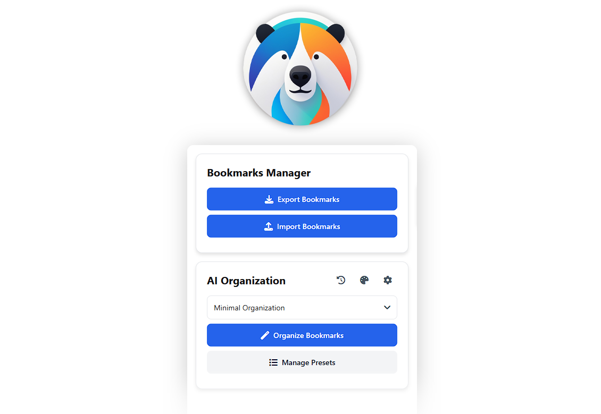
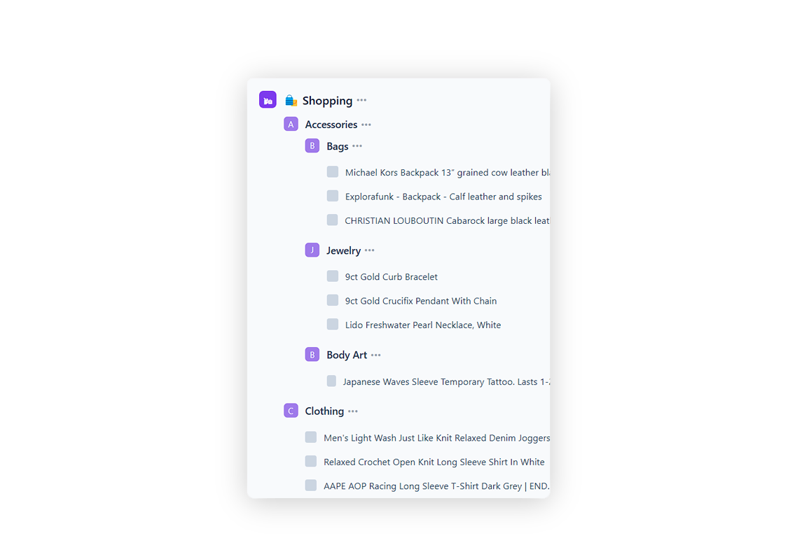
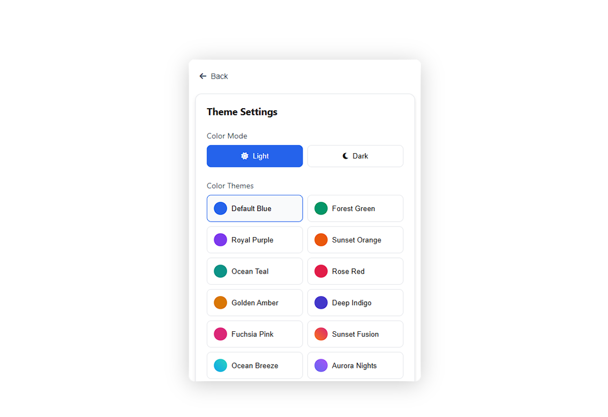
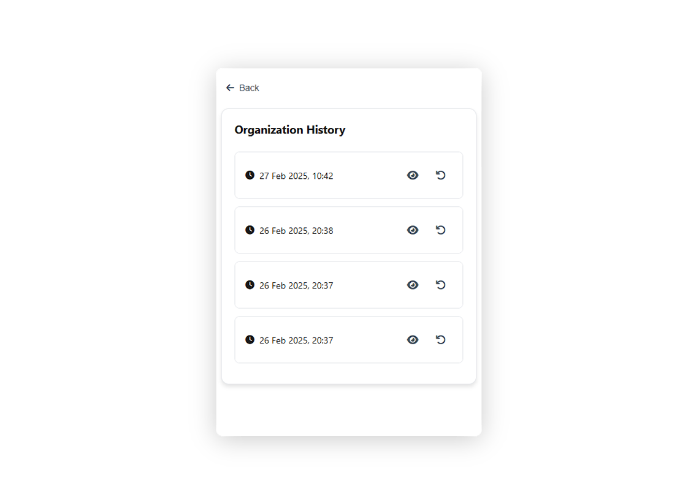
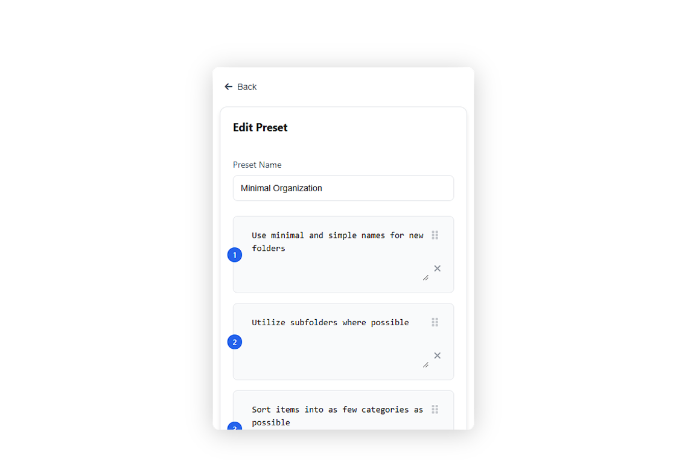
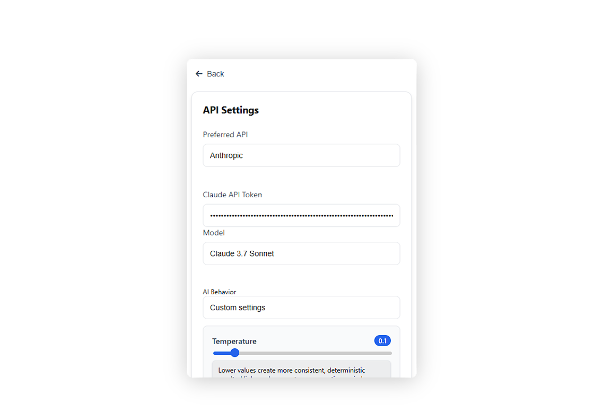

# AIBookmarkManager

## Overview

AIBookmarkManager is a Chrome extension that uses artificial intelligence to organize your browser bookmarks automatically. It analyzes your bookmarks and arranges them into logical folder structures, helping you maintain a clean and efficient bookmark collection.

## Key Features

### AI-Powered Organization

The core functionality of AIBookmarkManager is its ability to intelligently categorize bookmarks based on their content and URL patterns.

- Analyzes bookmark titles, URLs, and current locations
- Suggests optimal folder placements based on content relevance
- Creates necessary folder structures automatically
- Provides real-time progress tracking during organization

### Theme Customization

Personalize your experience with customizable themes and visual styles.

- Choose between light and dark modes
- Select from various color themes (default, green, purple, orange, etc.)
- Apply gradient options for a more dynamic look
- Responsive UI elements that adapt to your theme choice

### History Management

Keep track of organizational changes and restore previous states when needed.

- Records before and after states for each organization session
- One-click restoration of previous bookmark structures
- Detailed view comparisons between states
- Maintains history of recent organization sessions

### Preset Management

Create and save different organizational strategies to suit various needs.

- Define custom instructions for how bookmarks should be organized
- Save multiple organization presets for different purposes
- Apply consistent organization rules across sessions
- Easily switch between different organizational approaches

### Settings Configuration

Fine-tune the extension's behavior and AI connectivity options.

- Connect to OpenAI or Anthropic Claude services
- Adjust AI parameters like temperature and token limits
- Test API connections directly from the settings panel
- Select behavior presets for different organization styles

## How It Works

AIBookmarkManager follows a straightforward process to organize your bookmarks:

1. The extension collects information about your bookmarks and current folder structure
2. Each bookmark is analyzed by the AI service using your selected preset instructions
3. Based on AI recommendations, bookmarks are moved to their suggested locations
4. New folders are created as needed to accommodate the organizational structure
5. A detailed report summarizes the changes made during the process

## Technical Architecture

The extension is built with a modular JavaScript architecture consisting of several key components:

- **BookmarkManager**: Handles the core bookmark organization functionality
- **ThemeManager**: Controls visual appearance and UI customization
- **HistoryManager**: Tracks changes and enables restoration of previous states
- **SettingsManager**: Manages API connections and user preferences
- **PresetManager**: Handles organization presets and custom instructions

## Privacy & Security

AIBookmarkManager prioritizes your privacy and data security:

- Bookmark data is only processed when you initiate the organization
- No bookmark information is permanently stored outside your browser
- Secure communication with AI services using your personal API keys
- All processing happens on-demand and with your explicit permission

## Getting Started

1. Install AIBookmarkManager from the Chrome Web Store
2. Set up your API connection in the extension settings
3. Create or select an organization preset
4. Click the "Organize" button to start the automation process

## Requirements

- Google Chrome browser (version 88 or higher)
- API key for either OpenAI or Anthropic Claude

## License

AIBookmarkManager is released under the MIT License.